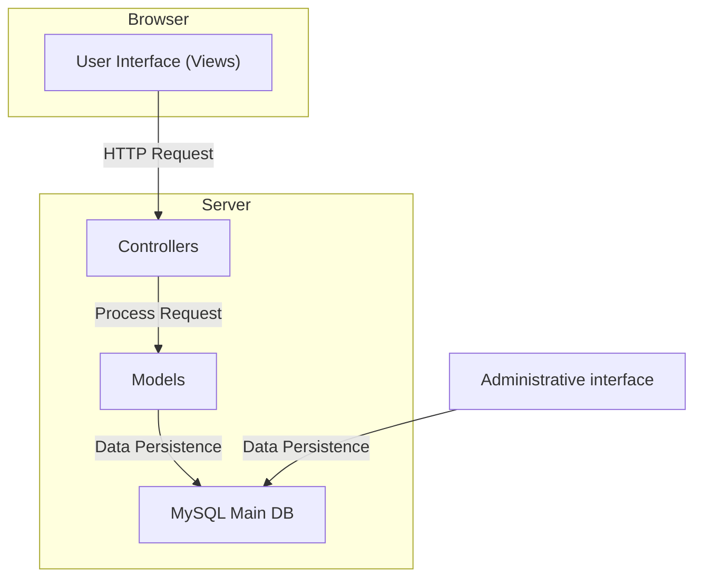

```mermaid
flowchart TD

 subgraph subGraph1["Browser"]
        A["User Interface (Views)"]
 end


 subgraph subGraph2["Server"]
        B["Controllers"]
        G["Models"]
        E["MySQL Main DB"]
  end

    A["User Interface (Views)"] -- HTTP Request --> B["Controllers"]
    B -- Process Request --> G
    G -- Data Persistence --> E

L["Administrative interface"] -- Data Persistence --> E


```