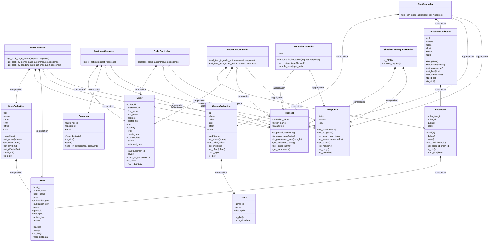

```mermaid
classDiagram
class BookController {
    +get_book_page_action(request, response)
    +get_book_by_genre_page_action(request, response)
    +get_book_by_random_page_action(request, response)
}

class CartController {
    +get_cart_page_action(request, response)
}

class CustomerController {
    +log_in_action(request, response)
}

class OrderController {
    +complete_order_action(request, response)
}

class OrderItemController {
    +add_item_to_order_action(request, response)
    +del_item_from_order_action(request, response)
}

class StaticFileController {
    +path
    +send_static_file_action(request, response)
    +get_content_type(file_path)
    +compile_scss(input_path)
}

class Book {
    +book_id
    +author_name
    +book_name
    +price
    +publication_year
    +publication_city
    +genre
    +genre_id
    +description
    +author_info
    +review
    +load(id)
    +save()
    +to_dict()
    +from_dict(data)
}

class BookCollection {
    +sql
    +where
    +order
    +limit
    +offset
    +data
    +load(filters)
    +set_where(where)
    +set_order(order)
    +set_limit(limit)
    +set_offset(offset)
    +build_sql()
    +to_dict()
}

class Customer {
    +customer_id
    +password
    +email
    +from_dict(data)
    +to_dict()
    +save()
    +load_by_email(email, password)
}

class Genre {
    +genre_id
    +genre
    +description
    +to_dict()
    +from_dict(data)
}

class GenresCollection {
    +sql
    +where
    +order
    +limit
    +offset
    +data
    +load(filters)
    +set_where(where)
    +set_order(order)
    +set_limit(limit)
    +set_offset(offset)
    +build_sql()
    +to_dict()
}

class Order {
    +order_id
    +customer_id
    +first_name
    +last_name
    +address
    +postal_zip
    +city
    +country
    +total
    +create_date
    +update_date
    +status
    +shipment_date
    +load(customer_id)
    +save()
    +mark_as_complete(...)
    +to_dict()
    +from_dict(data)
}

class OrderItem {
    +order_item_id
    +order_id
    +quantity
    +book
    +load(id)
    +delete()
    +save()
    +set_book(book_id)
    +set_order_id(order_id)
    +to_dict()
    +from_dict(data)
}

class OrderItemCollection {
    +sql
    +where
    +order
    +limit
    +offset
    +data
    +load(filters)
    +set_where(where)
    +set_order(order)
    +set_limit(limit)
    +set_offset(offset)
    +build_sql()
    +to_dict()
}

class Response {
    +status
    +headers
    +body
    +set_status(status)
    +set_body(data)
    +set_binary_body(data)
    +set_header(name, value)
    +get_status()
    +get_headers()
    +get_body()
    +set_json(data)
}

class Request {
    +controller_name
    +action_name
    +parameters
    +to_pascal_case(string)
    +to_snake_case(string)
    +to_parameters_map(path_list)
    +get_controller_name()
    +get_action_name()
    +get_parameters()
}

class SimpleHTTPRequestHandler {
    +do_GET()
    +process_request()
}

BookController o--> Response : aggregation
CartController o--> Response : aggregation
CustomerController o--> Response : aggregation
OrderController o--> Response : aggregation
OrderItemController o--> Response : aggregation
StaticFileController o--> Response : aggregation

BookController o--> Request: aggregation
CartController o--> Request: aggregation
CustomerController o--> Request: aggregation
OrderController o--> Request: aggregation
OrderItemController o--> Request: aggregation
StaticFileController o--> Request : aggregation

BookController *--> Book : composition
BookController *--> GenresCollection : composition
BookController *--> BookCollection : composition

CartController *--> OrderItemCollection : composition
CartController *--> GenresCollection : composition

CustomerController *--> Customer : composition
CustomerController *--> Order : composition

OrderController *--> Order : composition

OrderItemController *--> Order : composition
OrderItemController *--> OrderItem : composition

BookCollection *--> Book : composition
GenresCollection *--> Genre: composition
OrderItem *--> Book : composition
OrderItemCollection *--> OrderItem: composition

SimpleHTTPRequestHandler *--> Response : composition
SimpleHTTPRequestHandler *--> Request: composition


```